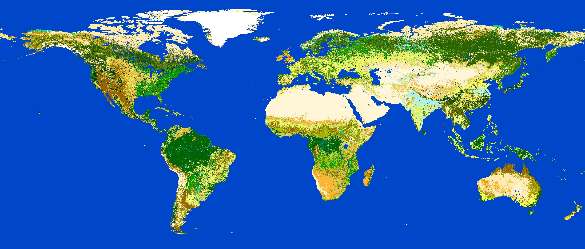

[ WORK IN PROGRESS ]

This repository answers the following simple question:

> Can a squirrel cross from north to south spain without touching the ground?

The answer is: **obviously not**. But, another question arises, and this one is not so easy to answer:

> If a squirrel had to go from the north of Spain to the south, touching the ground as little as posisble: which way would it follow?

The answer is not trivial.

# The procedure

I used the [GlovCover](http://due.esrin.esa.int/page_globcover.php) maps from the ESA to get information of the land use. The resolution is around 200m, accurate enough for this purpose. The map spans the whole world but here we are just interested in Spain. So the first step is to load the image raster and crop it.

The cropped raster image needs to be converted to a directed graph:

  * Each pixel is a node
  * Each node is connected to its adjacent pixels (edge)
  * The weights of each edge correspond to the "roughness" level of the destination pixel. Less roughness means more trees.
  
Having such a graph, the last step is to calculate the shortest path between two nodes - and there we have the path the smart squirrel would follow!

# The coding

The code is purely R. Creating the network matrix runs really slow, so some optimziation needs to be done.

# The solution

This is just a small example:

<iframe src="example.html" height="400" width="800" allowfullscreen="" frameborder="0"> </iframe>

